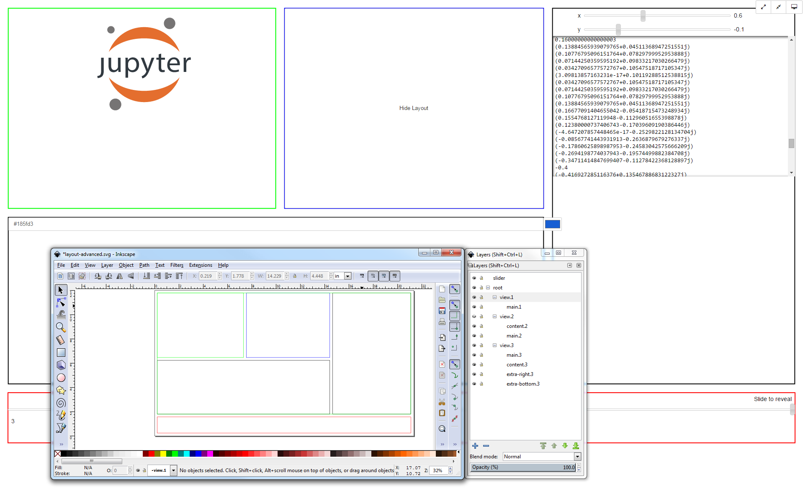

# IPython Widgets for Layout and Presentation

This is a set of widgets for the IPython Notebook that aids in layout out and
organizing widgets on the screen.



They should adhere as closely as possible to the ipywidgets API/canonical 
`DOMWidget` examples, and expect `width`, `height`, etc.

## Installation

```
pip install https://github.com/openseat/ipylayoutwidgets/archive/master.zip#egg=IPyLayoutWidgets

# see jupyter nbextension install for options
python -m ipylayoutwidgets.install
```


## `FullscreenBox`
Shows its `children` in:
- its allotted space (minimized)
- the entire browsing window, minus the menu/URL bar (maximized)
- fullscreen, letterboxed to the element's size (fullscreen minimized)
- fullscreen, fill to cover (fullscreen maximized)


## `SVGLayoutBox`
Positions/sizes its `children` coincident with layers defined in an Inkscape
SVG file.

### Basic Features
The following data are available on every instance as `traitlets`.

#### `svg_file`
The filename of an SVG to use for layout.

#### `svg`
The text of the SVG file. You could use this directly with generated SVG, for example.

#### `show_svg` _True_
Should the underlying SVG be show behind the `children`?

#### `widget_map`
A dictionary of widget instances keyed by the inkscape:label of a layer. 

```
svg.widget_map = {
    "toolbar": ToolbarWidget(),
    "info_pane": Text()
}
```

#### `visible_layers` _["*"], all Layers_
A list of leaf layer labels that are visible: all parent layers of leaves will also be visible.

### Advanced Usage
Both `widget_map` and `visible_layers` accept * as wildcard, allowing you to dynamically move 
widgets to different predefined layer locations based on context.

```python
svg.widget_map = {
    "splash page": SplashPage(),
    "toolbar.*": ToolbarWidget(),
}

svg.visible_layers = ["splash page"]

time.sleep()

svg.visible_layers = ["toolbar.home"]
```

For detailed examples, check out the `/notebooks`.

©2015 Georgia Tech Applied Research Corporation